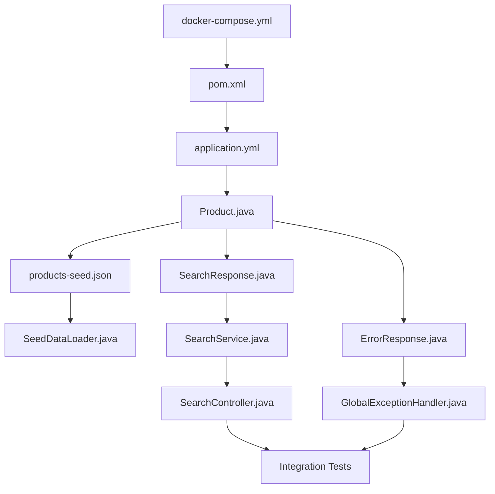

# Implementation Plan: Product Catalog Search

This document defines the step-by-step implementation phases, file dependencies, verification milestones, and testing routines required to build the Product Catalog Search system.

---

## 1. Execution Dependency Tree

Before starting code implementation, the dependency order of the files must be established to prevent compilation errors and ensure smooth incremental integration.

---

## 2. Implementation Phases

### Phase 1: Infrastructure & Base Build Setup
* **Objective**: Spin up external services (Elasticsearch, Kibana) and establish the Maven dependency baseline.
* **Tasks**:
  1. Create [docker-compose.yml](file:///C:/Users/ALBIN/Desktop/main/DEV/sample-springboot-elasticsearch/docker-compose.yml) in the project root.
  2. Create [pom.xml](file:///C:/Users/ALBIN/Desktop/main/DEV/sample-springboot-elasticsearch/pom.xml) in the project root containing dependencies:
     * `spring-boot-starter-web`
     * `spring-boot-starter-data-elasticsearch`
     * `lombok` (optional but recommended for clean code)
     * `spring-boot-starter-test` (for unit/integration tests)
  3. Run `docker-compose up -d` to start containers.
  4. Build project skeleton using Maven: `mvn clean compile`.
* **Verification**:
  * Run `curl -I http://localhost:9200/_cluster/health` (verify HTTP 200 and cluster status green or yellow).
  * Access Kibana UI at `http://localhost:5601`.

---

### Phase 2: Configuration & Domain Mapping
* **Objective**: Define connection properties and establish strict mapping rules for the search entity.
* **Tasks**:
  1. Create [application.yml](file:///C:/Users/ALBIN/Desktop/main/DEV/sample-springboot-elasticsearch/src/main/resources/application.yml) to configure ports, URIs, and logging.
  2. Create the main application runner class [CatalogApplication.java](file:///C:/Users/ALBIN/Desktop/main/DEV/sample-springboot-elasticsearch/src/main/java/com/example/catalog/CatalogApplication.java).
  3. Create domain class [Product.java](file:///C:/Users/ALBIN/Desktop/main/DEV/sample-springboot-elasticsearch/src/main/java/com/example/catalog/model/Product.java) using Spring Data annotations to disable dynamic mapping.
* **Verification**:
  * Start the Spring Boot skeleton. Verify no connection exceptions are thrown.

---

### Phase 3: Idempotent Seeding Implementation
* **Objective**: Ensure the database automatically seeds catalog items on initial startup without duplicating them on restarts.
* **Tasks**:
  1. Add sample dataset [products-seed.json](file:///C:/Users/ALBIN/Desktop/main/DEV/sample-springboot-elasticsearch/src/main/resources/products-seed.json) containing 25+ products representing multiple prices and categories.
  2. Create [SeedDataLoader.java](file:///C:/Users/ALBIN/Desktop/main/DEV/sample-springboot-elasticsearch/src/main/java/com/example/catalog/config/SeedDataLoader.java) implementing `CommandLineRunner`.
* **Verification**:
  * Boot the application.
  * Check log statement: `Successfully seeded X products into Elasticsearch`.
  * Open Kibana Dev Tools Console and query: `GET /products/_count` (ensure the count equals the seed size).
  * Restart the application and verify: `Index 'products' already contains X records. Skipping seeding.` is logged.

---

### Phase 4: Business Logic & Query DSL Development
* **Objective**: Build the core text search and filtering algorithms.
* **Tasks**:
  1. Create response DTO [SearchResponse.java](file:///C:/Users/ALBIN/Desktop/main/DEV/sample-springboot-elasticsearch/src/main/java/com/example/catalog/dto/SearchResponse.java) mapping documents, pagination, and aggregates.
  2. Create [SearchService.java](file:///C:/Users/ALBIN/Desktop/main/DEV/sample-springboot-elasticsearch/src/main/java/com/example/catalog/service/SearchService.java). Include:
     * Fuzziness logic (`fuzziness(AUTO)`) for typos.
     * Scoring boost for the title (`name^2`).
     * Scored filters for category and price ranges (min/max).
     * Terms aggregation on `category`.
* **Verification**:
  * Write a unit test asserting query construction values.

---

### Phase 5: REST Endpoint & Exception Boundary Setup
* **Objective**: Expose the `/search` endpoint, validate user inputs, and map internal connection errors into clean client messages.
* **Tasks**:
  1. Create [SearchController.java](file:///C:/Users/ALBIN/Desktop/main/DEV/sample-springboot-elasticsearch/src/main/java/com/example/catalog/controller/SearchController.java).
  2. Define parameters validation constraints (e.g. `minPrice <= maxPrice`).
  3. Create error DTO [ErrorResponse.java](file:///C:/Users/ALBIN/Desktop/main/DEV/sample-springboot-elasticsearch/src/main/java/com/example/catalog/dto/ErrorResponse.java).
  4. Create controller advice handler [GlobalExceptionHandler.java](file:///C:/Users/ALBIN/Desktop/main/DEV/sample-springboot-elasticsearch/src/main/java/com/example/catalog/controller/GlobalExceptionHandler.java) mapping `IllegalArgumentException` (400), connectivity errors (503), and runtime fallbacks (500).
* **Verification**:
  * Start the service. Run verification curls detailed in the API contract.

---

## 3. Post-Implementation Testing Plan

After finishing all phases, execute the following manual/automated checks.

### 3.1 Verification Matrix
| Test Case | Method / URL | Query Params | Expected HTTP Status | Expected Outcome |
| :--- | :--- | :--- | :--- | :--- |
| **Simple Search** | `GET /search` | `q=phone` | 200 OK | Relevance-ranked list of smartphones. |
| **Typo Tolerance** | `GET /search` | `q=phne` | 200 OK | Returns smartphones despite typo. |
| **Category Filter** | `GET /search` | `category=home` | 200 OK | Return matches containing only category "home". |
| **Price Filtering** | `GET /search` | `minPrice=200&maxPrice=600` | 200 OK | All results fall within `[200.0, 600.0]`. |
| **Dynamic Facets** | `GET /search` | `q=phone` | 200 OK | Facet counts only cover categories matching the query. |
| **Bad Range Input**| `GET /search` | `minPrice=500&maxPrice=10` | 400 Bad Request | Error body indicating invalid boundaries. |
| **Database Failure**| `GET /search` | *None* | 503 Service Unavailable | (When ES container is stopped) Safe error JSON. |
